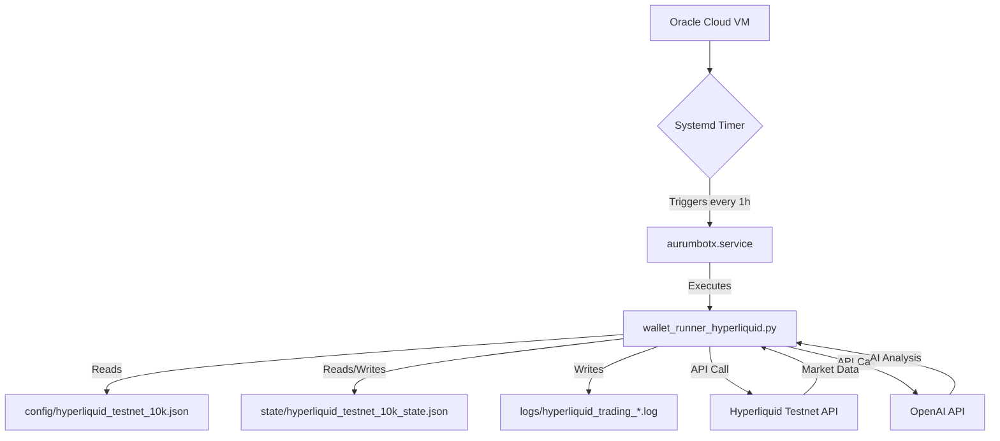

# AurumBotX - AI-Powered Crypto Trading Bot

**Version: 4.1 Hyperliquid**  
**Status: Production Ready**  
**Environment: Hyperliquid Testnet + Oracle Cloud**

---

## 🚀 Quick Start (5 minuti)

### 1. Ottieni Fondi Testnet

1. Vai su: https://app.hyperliquid-testnet.xyz/trade
2. Connect MetaMask
3. Clicca **"Faucet"** → Get testnet USDC

### 2. Genera API Keys

1. Settings (⚙️) → **API**
2. Clicca **"Generate New Key"**
3. Copia **Account Address** e **Private Key**

### 3. Configura Bot

```bash
# Clone repository
git clone https://github.com/Rexon-Pambujya/AurumBotX.git
cd AurumBotX

# Create virtual environment
python3 -m venv venv
source venv/bin/activate

# Install dependencies
pip install -r requirements.txt

# Configure environment
cp .env.example .env
nano .env
```

Inserisci nel `.env`:
```env
HYPERLIQUID_TESTNET=true
HYPERLIQUID_ACCOUNT_ADDRESS=0xYOUR_ADDRESS
HYPERLIQUID_SECRET_KEY=0xYOUR_PRIVATE_KEY
OPENAI_API_KEY=sk-YOUR_OPENAI_KEY
```

### 4. Test Bot

```bash
python3 wallet_runner_hyperliquid.py config/hyperliquid_testnet_10k.json
```

✅ Dovresti vedere analisi di 6 pair crypto!

---

## ☁️ Deploy su Oracle Cloud (60 minuti)

Per avere il bot operativo 24/7 **GRATIS**, segui la guida completa:

**[➡️ ORACLE_CLOUD_DEPLOYMENT_GUIDE.md](./docs/ORACLE_CLOUD_DEPLOYMENT_GUIDE.md)**

**TL;DR**:
1. Crea account Oracle Cloud (gratis permanente)
2. Crea VM Always Free (Ubuntu 22.04)
3. SSH nella VM
4. Esegui: `./scripts/setup_oracle_cloud.sh`
5. Configura `.env`
6. Avvia timer: `sudo systemctl start aurumbotx-hyperliquid.timer`

**Risultato**: Bot operativo 24/7, €0/mese!

---

## 📊 Architettura



---

## ⚙️ Componenti Chiave

### Bot Core

- **`wallet_runner_hyperliquid.py`**: Logica principale del bot
- **`config/hyperliquid_testnet_10k.json`**: Parametri di trading
- **`requirements.txt`**: Dipendenze Python

### Deployment

- **`scripts/setup_oracle_cloud.sh`**: Script setup automatico
- **`scripts/aurumbotx-hyperliquid.service`**: Systemd service
- **`scripts/aurumbotx-hyperliquid.timer`**: Systemd timer (1h)

### Documentazione

- **`docs/ORACLE_CLOUD_DEPLOYMENT_GUIDE.md`**: Guida completa
- **`docs/HYPERLIQUID_QUICKSTART.md`**: Quick start
- **`docs/HYPERLIQUID_DEPLOYMENT_SUMMARY.md`**: Riepilogo

---

## 📈 Performance Attese

| Periodo | Cicli | Trade | Dati | Costo |
|---------|-------|-------|------|-------|
| **24 ore** | 24 | 4-8 | 144 analisi | €0.16 |
| **7 giorni** | 168 | 30-60 | 1,008 analisi | €1.20 |
| **30 giorni** | 720 | 120-240 | 4,320 analisi | €5 |

---

## 💰 Costi

| Servizio | Costo/Mese |
|----------|------------|
| **Oracle Cloud VM** | €0 (Always Free) |
| **Hyperliquid Testnet** | €0 |
| **OpenAI API** | €2-5 |
| **TOTALE** | **€2-5/mese** |

---

## 📞 Supporto

- 📖 **Guida Completa**: [ORACLE_CLOUD_DEPLOYMENT_GUIDE.md](./docs/ORACLE_CLOUD_DEPLOYMENT_GUIDE.md)
- 🐛 **Issues**: https://github.com/Rexon-Pambujya/AurumBotX/issues
- 📚 **Docs Hyperliquid**: https://hyperliquid.gitbook.io/

---

**Made with 💡 by Manus AI**
