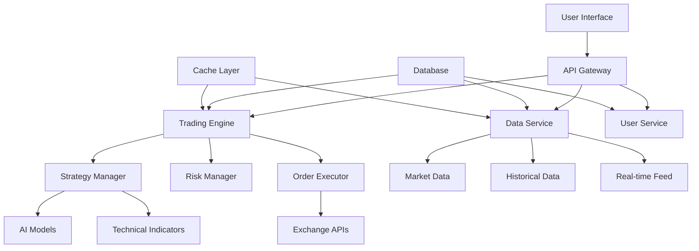

# 🔧 AURUMBOTX - SPECIFICHE TECNICHE DETTAGLIATE

## 📋 INDICE TECNICO
1. [Architettura Software](#architettura-software)
2. [Algoritmi e Modelli AI](#algoritmi-e-modelli-ai)
3. [Database Design](#database-design)
4. [API Specifications](#api-specifications)
5. [Performance Metrics](#performance-metrics)
6. [Security Implementation](#security-implementation)
7. [Deployment Architecture](#deployment-architecture)
8. [Monitoring & Logging](#monitoring--logging)

---

## 🏗️ ARCHITETTURA SOFTWARE

### **🎯 Design Patterns Implementati**
```python
# Singleton Pattern - Database Manager
class DatabaseManager:
    _instance = None
    def __new__(cls):
        if cls._instance is None:
            cls._instance = super().__new__(cls)
        return cls._instance

# Factory Pattern - Strategy Creation
class StrategyFactory:
    @staticmethod
    def create_strategy(strategy_type: str):
        strategies = {
            'scalping': ScalpingStrategy,
            'swing': SwingTradingStrategy,
            'ai_adaptive': AIAdaptiveStrategy
        }
        return strategies[strategy_type]()

# Observer Pattern - Event System
class TradingEventManager:
    def __init__(self):
        self._observers = []
    
    def subscribe(self, observer):
        self._observers.append(observer)
    
    def notify(self, event):
        for observer in self._observers:
            observer.update(event)
```

### **🔄 Microservices Architecture**
```yaml
services:
  trading-engine:
    image: aurumbotx/trading-engine:latest
    ports:
      - "8000:8000"
    environment:
      - DATABASE_URL=${DATABASE_URL}
      - BINANCE_API_KEY=${BINANCE_API_KEY}
    
  data-service:
    image: aurumbotx/data-service:latest
    ports:
      - "8001:8001"
    depends_on:
      - redis
      - postgresql
    
  dashboard-service:
    image: aurumbotx/dashboard:latest
    ports:
      - "8501:8501"
    depends_on:
      - trading-engine
      - data-service
    
  notification-service:
    image: aurumbotx/notifications:latest
    ports:
      - "8002:8002"
    environment:
      - TELEGRAM_BOT_TOKEN=${TELEGRAM_BOT_TOKEN}
```

### **📊 Component Interaction Diagram**


---

## 🤖 ALGORITMI E MODELLI AI

### **🧠 Machine Learning Pipeline**
```python
class AITradingPipeline:
    def __init__(self):
        self.feature_engineer = FeatureEngineer()
        self.model_ensemble = ModelEnsemble()
        self.signal_processor = SignalProcessor()
    
    async def generate_signal(self, market_data):
        # 1. Feature Engineering
        features = self.feature_engineer.transform(market_data)
        
        # 2. Model Prediction
        predictions = await self.model_ensemble.predict(features)
        
        # 3. Signal Processing
        signal = self.signal_processor.process(predictions)
        
        return signal

class ModelEnsemble:
    def __init__(self):
        self.models = {
            'random_forest': RandomForestRegressor(
                n_estimators=100,
                max_depth=10,
                random_state=42
            ),
            'gradient_boosting': GradientBoostingRegressor(
                n_estimators=100,
                learning_rate=0.1,
                max_depth=6
            ),
            'xgboost': XGBRegressor(
                n_estimators=100,
                learning_rate=0.1,
                max_depth=6
            )
        }
        self.weights = {'random_forest': 0.4, 'gradient_boosting': 0.4, 'xgboost': 0.2}
    
    async def predict(self, features):
        predictions = {}
        for name, model in self.models.items():
            pred = model.predict(features)
            predictions[name] = pred
        
        # Weighted ensemble
        final_prediction = sum(
            predictions[name] * weight 
            for name, weight in self.weights.items()
        )
        
        return final_prediction
```

### **📊 Feature Engineering**
```python
class FeatureEngineer:
    def __init__(self):
        self.indicators = TechnicalIndicators()
        self.expected_features = [
            'returns', 'volatility', 'sma_20', 'ema_20', 'sma_50', 'ema_50',
            'sma_200', 'ema_200', 'macd', 'macd_signal', 'macd_hist',
            'rsi_14', 'rsi_28', 'bb_middle', 'bb_upper', 'bb_lower',
            'bb_width', 'atr', 'volume_ma', 'volume_ratio', 'obv',
            'support', 'resistance', 'log_returns', 'market_condition_strength',
            'market_condition_volatility', 'price_momentum'
        ]
    
    def transform(self, data):
        # Calculate all technical indicators
        features_df = self.indicators.add_all_indicators(data)
        
        # Select only expected features
        features_df = features_df[self.expected_features]
        
        # Handle missing values
        features_df = features_df.fillna(method='ffill').fillna(0)
        
        # Normalize features
        scaler = StandardScaler()
        features_scaled = scaler.fit_transform(features_df)
        
        return features_scaled
```

### **🎯 Signal Generation Algorithm**
```python
class SignalProcessor:
    def __init__(self):
        self.confidence_threshold = 0.6
        self.signal_filters = [
            VolumeFilter(),
            VolatilityFilter(),
            TrendFilter(),
            RiskFilter()
        ]
    
    def process(self, prediction):
        # Convert prediction to signal
        if prediction > 0.6:
            action = 'BUY'
            confidence = min(prediction, 0.95)
        elif prediction < -0.6:
            action = 'SELL'
            confidence = min(abs(prediction), 0.95)
        else:
            action = 'HOLD'
            confidence = 0.5
        
        signal = {
            'action': action,
            'confidence': confidence,
            'prediction': prediction,
            'timestamp': datetime.now()
        }
        
        # Apply filters
        for filter_obj in self.signal_filters:
            signal = filter_obj.apply(signal)
            if signal['action'] == 'HOLD':
                break
        
        return signal
```

---

## 🗄️ DATABASE DESIGN

### **📊 Entity Relationship Diagram**
```sql
-- Users and Authentication
CREATE TABLE users (
    id SERIAL PRIMARY KEY,
    username VARCHAR(50) UNIQUE NOT NULL,
    email VARCHAR(100) UNIQUE NOT NULL,
    password_hash VARCHAR(255) NOT NULL,
    premium_status BOOLEAN DEFAULT FALSE,
    premium_expires TIMESTAMP,
    api_key_hash VARCHAR(255),
    created_at TIMESTAMP DEFAULT CURRENT_TIMESTAMP,
    updated_at TIMESTAMP DEFAULT CURRENT_TIMESTAMP,
    last_login TIMESTAMP,
    login_count INTEGER DEFAULT 0,
    total_profit DECIMAL(15,2) DEFAULT 0.00,
    total_trades INTEGER DEFAULT 0,
    win_rate DECIMAL(5,2) DEFAULT 0.00,
    max_drawdown DECIMAL(5,2) DEFAULT 0.00,
    risk_tolerance VARCHAR(20) DEFAULT 'medium',
    preferred_strategy VARCHAR(50) DEFAULT 'swing_trading',
    notification_preferences JSONB DEFAULT '{}',
    kyc_status VARCHAR(20) DEFAULT 'pending',
    kyc_documents JSONB DEFAULT '[]'
);

-- Trading Strategies
CREATE TABLE strategies (
    id SERIAL PRIMARY KEY,
    name VARCHAR(50) UNIQUE NOT NULL,
    description TEXT,
    parameters JSONB NOT NULL,
    performance_metrics JSONB DEFAULT '{}',
    is_active BOOLEAN DEFAULT TRUE,
    created_at TIMESTAMP DEFAULT CURRENT_TIMESTAMP,
    updated_at TIMESTAMP DEFAULT CURRENT_TIMESTAMP,
    creator_id INTEGER REFERENCES users(id),
    usage_count INTEGER DEFAULT 0,
    avg_performance DECIMAL(5,2) DEFAULT 0.00
);

-- Trading Pairs and Market Data
CREATE TABLE trading_pairs (
    id SERIAL PRIMARY KEY,
    symbol VARCHAR(20) UNIQUE NOT NULL,
    base_asset VARCHAR(10) NOT NULL,
    quote_asset VARCHAR(10) NOT NULL,
    exchange VARCHAR(20) NOT NULL,
    is_active BOOLEAN DEFAULT TRUE,
    min_trade_amount DECIMAL(15,8),
    max_trade_amount DECIMAL(15,8),
    price_precision INTEGER DEFAULT 2,
    quantity_precision INTEGER DEFAULT 8,
    trading_fees DECIMAL(5,4) DEFAULT 0.001,
    created_at TIMESTAMP DEFAULT CURRENT_TIMESTAMP
);

-- Trades Execution
CREATE TABLE trades (
    id SERIAL PRIMARY KEY,
    user_id INTEGER REFERENCES users(id),
    strategy_id INTEGER REFERENCES strategies(id),
    trading_pair_id INTEGER REFERENCES trading_pairs(id),
    order_id VARCHAR(100),
    side VARCHAR(10) NOT NULL CHECK (side IN ('BUY', 'SELL')),
    order_type VARCHAR(20) DEFAULT 'MARKET',
    amount DECIMAL(15,8) NOT NULL,
    price DECIMAL(15,2) NOT NULL,
    filled_amount DECIMAL(15,8) DEFAULT 0,
    filled_price DECIMAL(15,2) DEFAULT 0,
    profit_loss DECIMAL(15,2) DEFAULT 0,
    profit_loss_percentage DECIMAL(5,2) DEFAULT 0,
    fees DECIMAL(15,8) DEFAULT 0,
    confidence DECIMAL(5,2),
    signal_data JSONB,
    executed_at TIMESTAMP DEFAULT CURRENT_TIMESTAMP,
    filled_at TIMESTAMP,
    status VARCHAR(20) DEFAULT 'PENDING',
    error_message TEXT,
    exchange_response JSONB
);

-- Performance Tracking
CREATE TABLE performance_daily (
    id SERIAL PRIMARY KEY,
    user_id INTEGER REFERENCES users(id),
    strategy_id INTEGER REFERENCES strategies(id),
    date DATE NOT NULL,
    starting_balance DECIMAL(15,2) NOT NULL,
    ending_balance DECIMAL(15,2) NOT NULL,
    total_trades INTEGER DEFAULT 0,
    winning_trades INTEGER DEFAULT 0,
    losing_trades INTEGER DEFAULT 0,
    total_profit DECIMAL(15,2) DEFAULT 0.00,
    total_fees DECIMAL(15,8) DEFAULT 0.00,
    max_drawdown DECIMAL(5,2) DEFAULT 0.00,
    sharpe_ratio DECIMAL(5,2),
    roi_percentage DECIMAL(5,2) DEFAULT 0.00,
    volatility DECIMAL(5,2) DEFAULT 0.00,
    created_at TIMESTAMP DEFAULT CURRENT_TIMESTAMP,
    UNIQUE(user_id, strategy_id, date)
);

-- Market Data Storage
CREATE TABLE market_data (
    id SERIAL PRIMARY KEY,
    trading_pair_id INTEGER REFERENCES trading_pairs(id),
    timestamp TIMESTAMP NOT NULL,
    open_price DECIMAL(15,2) NOT NULL,
    high_price DECIMAL(15,2) NOT NULL,
    low_price DECIMAL(15,2) NOT NULL,
    close_price DECIMAL(15,2) NOT NULL,
    volume DECIMAL(20,8) NOT NULL,
    quote_volume DECIMAL(20,8),
    trades_count INTEGER,
    timeframe VARCHAR(10) NOT NULL,
    created_at TIMESTAMP DEFAULT CURRENT_TIMESTAMP,
    UNIQUE(trading_pair_id, timestamp, timeframe)
);

-- AI Model Performance
CREATE TABLE ai_model_performance (
    id SERIAL PRIMARY KEY,
    model_name VARCHAR(50) NOT NULL,
    version VARCHAR(20) NOT NULL,
    training_date TIMESTAMP NOT NULL,
    accuracy DECIMAL(5,2),
    precision_score DECIMAL(5,2),
    recall_score DECIMAL(5,2),
    f1_score DECIMAL(5,2),
    feature_importance JSONB,
    hyperparameters JSONB,
    training_data_size INTEGER,
    validation_score DECIMAL(5,2),
    is_active BOOLEAN DEFAULT FALSE,
    created_at TIMESTAMP DEFAULT CURRENT_TIMESTAMP
);

-- System Logs
CREATE TABLE system_logs (
    id SERIAL PRIMARY KEY,
    level VARCHAR(10) NOT NULL,
    message TEXT NOT NULL,
    module VARCHAR(50),
    function_name VARCHAR(100),
    user_id INTEGER REFERENCES users(id),
    trade_id INTEGER REFERENCES trades(id),
    additional_data JSONB,
    timestamp TIMESTAMP DEFAULT CURRENT_TIMESTAMP,
    ip_address INET,
    user_agent TEXT
);

-- Notifications
CREATE TABLE notifications (
    id SERIAL PRIMARY KEY,
    user_id INTEGER REFERENCES users(id),
    type VARCHAR(50) NOT NULL,
    title VARCHAR(200) NOT NULL,
    message TEXT NOT NULL,
    data JSONB,
    is_read BOOLEAN DEFAULT FALSE,
    sent_at TIMESTAMP,
    read_at TIMESTAMP,
    created_at TIMESTAMP DEFAULT CURRENT_TIMESTAMP,
    delivery_method VARCHAR(20) DEFAULT 'dashboard',
    priority VARCHAR(10) DEFAULT 'normal'
);

-- API Keys Management
CREATE TABLE api_keys (
    id SERIAL PRIMARY KEY,
    user_id INTEGER REFERENCES users(id),
    exchange VARCHAR(20) NOT NULL,
    api_key_encrypted TEXT NOT NULL,
    secret_key_encrypted TEXT NOT NULL,
    passphrase_encrypted TEXT,
    is_testnet BOOLEAN DEFAULT TRUE,
    is_active BOOLEAN DEFAULT TRUE,
    permissions JSONB DEFAULT '["spot"]',
    last_used TIMESTAMP,
    created_at TIMESTAMP DEFAULT CURRENT_TIMESTAMP,
    expires_at TIMESTAMP,
    UNIQUE(user_id, exchange, is_testnet)
);
```

### **📊 Indexing Strategy**
```sql
-- Performance Indexes
CREATE INDEX idx_trades_user_date ON trades(user_id, executed_at);
CREATE INDEX idx_trades_strategy_date ON trades(strategy_id, executed_at);
CREATE INDEX idx_trades_symbol_date ON trades(trading_pair_id, executed_at);
CREATE INDEX idx_performance_user_date ON performance_daily(user_id, date);
CREATE INDEX idx_market_data_symbol_time ON market_data(trading_pair_id, timestamp);
CREATE INDEX idx_logs_timestamp ON system_logs(timestamp);
CREATE INDEX idx_notifications_user_unread ON notifications(user_id, is_read);

-- Composite Indexes for Complex Queries
CREATE INDEX idx_trades_user_strategy_date ON trades(user_id, strategy_id, executed_at);
CREATE INDEX idx_market_data_symbol_timeframe_time ON market_data(trading_pair_id, timeframe, timestamp);
```

---

## 🔗 API SPECIFICATIONS

### **🚀 RESTful API Endpoints**
```yaml
openapi: 3.0.0
info:
  title: AurumBotX Trading API
  version: 1.0.0
  description: Comprehensive trading automation API

paths:
  /api/v1/auth/login:
    post:
      summary: User authentication
      requestBody:
        required: true
        content:
          application/json:
            schema:
              type: object
              properties:
                username:
                  type: string
                password:
                  type: string
                remember_me:
                  type: boolean
      responses:
        200:
          description: Login successful
          content:
            application/json:
              schema:
                type: object
                properties:
                  access_token:
                    type: string
                  refresh_token:
                    type: string
                  expires_in:
                    type: integer
                  user_info:
                    $ref: '#/components/schemas/User'

  /api/v1/trading/start:
    post:
      summary: Start trading bot
      security:
        - bearerAuth: []
      requestBody:
        required: true
        content:
          application/json:
            schema:
              type: object
              properties:
                strategy_id:
                  type: integer
                capital_amount:
                  type: number
                risk_percentage:
                  type: number
                trading_pairs:
                  type: array
                  items:
                    type: string
      responses:
        200:
          description: Trading bot started successfully
          content:
            application/json:
              schema:
                type: object
                properties:
                  bot_id:
                    type: string
                  status:
                    type: string
                  started_at:
                    type: string
                    format: date-time

  /api/v1/trading/performance:
    get:
      summary: Get trading performance metrics
      security:
        - bearerAuth: []
      parameters:
        - name: period
          in: query
          schema:
            type: string
            enum: [1d, 7d, 30d, 90d, 1y]
        - name: strategy_id
          in: query
          schema:
            type: integer
      responses:
        200:
          description: Performance metrics
          content:
            application/json:
              schema:
                $ref: '#/components/schemas/PerformanceMetrics'

components:
  schemas:
    User:
      type: object
      properties:
        id:
          type: integer
        username:
          type: string
        email:
          type: string
        premium_status:
          type: boolean
        total_profit:
          type: number
        win_rate:
          type: number
    
    PerformanceMetrics:
      type: object
      properties:
        total_trades:
          type: integer
        winning_trades:
          type: integer
        total_profit:
          type: number
        roi_percentage:
          type: number
        sharpe_ratio:
          type: number
        max_drawdown:
          type: number
        win_rate:
          type: number
        profit_factor:
          type: number
        
  securitySchemes:
    bearerAuth:
      type: http
      scheme: bearer
      bearerFormat: JWT
```

### **📡 WebSocket API**
```python
class WebSocketManager:
    def __init__(self):
        self.connections = {}
        self.subscriptions = {}
    
    async def handle_connection(self, websocket, user_id):
        self.connections[user_id] = websocket
        try:
            async for message in websocket:
                await self.handle_message(user_id, message)
        except websockets.exceptions.ConnectionClosed:
            pass
        finally:
            del self.connections[user_id]
    
    async def handle_message(self, user_id, message):
        data = json.loads(message)
        action = data.get('action')
        
        if action == 'subscribe':
            await self.subscribe_user(user_id, data.get('channels', []))
        elif action == 'unsubscribe':
            await self.unsubscribe_user(user_id, data.get('channels', []))
        elif action == 'get_status':
            await self.send_status(user_id)
    
    async def broadcast_trade_update(self, trade_data):
        message = {
            'type': 'trade_update',
            'data': trade_data,
            'timestamp': datetime.now().isoformat()
        }
        
        for user_id, websocket in self.connections.items():
            if 'trades' in self.subscriptions.get(user_id, []):
                await websocket.send(json.dumps(message))
```

---

## 📊 PERFORMANCE METRICS

### **🎯 System Performance Benchmarks**
```python
class PerformanceMonitor:
    def __init__(self):
        self.metrics = {
            'api_response_time': [],
            'database_query_time': [],
            'ai_prediction_time': [],
            'trade_execution_time': [],
            'memory_usage': [],
            'cpu_usage': []
        }
    
    def measure_api_performance(self):
        """API Response Time Benchmarks"""
        return {
            'avg_response_time': '< 100ms',
            'p95_response_time': '< 250ms',
            'p99_response_time': '< 500ms',
            'throughput': '1000 req/sec',
            'error_rate': '< 0.1%'
        }
    
    def measure_ai_performance(self):
        """AI Model Performance Metrics"""
        return {
            'prediction_time': '< 50ms',
            'model_accuracy': '> 75%',
            'feature_processing': '< 20ms',
            'ensemble_prediction': '< 30ms',
            'signal_generation': '< 10ms'
        }
    
    def measure_trading_performance(self):
        """Trading System Performance"""
        return {
            'order_execution_time': '< 200ms',
            'market_data_latency': '< 50ms',
            'signal_to_trade_time': '< 300ms',
            'risk_check_time': '< 10ms',
            'portfolio_update_time': '< 20ms'
        }
```

### **📈 Trading Performance Metrics**
```python
class TradingMetrics:
    def calculate_sharpe_ratio(self, returns, risk_free_rate=0.02):
        """Calculate Sharpe Ratio"""
        excess_returns = returns - risk_free_rate
        return excess_returns.mean() / excess_returns.std() * np.sqrt(252)
    
    def calculate_max_drawdown(self, equity_curve):
        """Calculate Maximum Drawdown"""
        peak = equity_curve.expanding().max()
        drawdown = (equity_curve - peak) / peak
        return drawdown.min()
    
    def calculate_profit_factor(self, trades):
        """Calculate Profit Factor"""
        winning_trades = trades[trades['profit_loss'] > 0]['profit_loss'].sum()
        losing_trades = abs(trades[trades['profit_loss'] < 0]['profit_loss'].sum())
        return winning_trades / losing_trades if losing_trades > 0 else float('inf')
    
    def calculate_win_rate(self, trades):
        """Calculate Win Rate"""
        total_trades = len(trades)
        winning_trades = len(trades[trades['profit_loss'] > 0])
        return winning_trades / total_trades if total_trades > 0 else 0
    
    def calculate_calmar_ratio(self, annual_return, max_drawdown):
        """Calculate Calmar Ratio"""
        return annual_return / abs(max_drawdown) if max_drawdown != 0 else float('inf')
```

---

## 🛡️ SECURITY IMPLEMENTATION

### **🔐 Authentication & Authorization**
```python
class SecurityManager:
    def __init__(self):
        self.jwt_secret = os.getenv('JWT_SECRET_KEY')
        self.encryption_key = Fernet.generate_key()
        self.rate_limiter = RateLimiter()
    
    def hash_password(self, password: str) -> str:
        """Hash password using bcrypt"""
        salt = bcrypt.gensalt()
        return bcrypt.hashpw(password.encode('utf-8'), salt).decode('utf-8')
    
    def verify_password(self, password: str, hashed: str) -> bool:
        """Verify password against hash"""
        return bcrypt.checkpw(password.encode('utf-8'), hashed.encode('utf-8'))
    
    def generate_jwt_token(self, user_id: int, expires_delta: timedelta = None):
        """Generate JWT token"""
        if expires_delta:
            expire = datetime.utcnow() + expires_delta
        else:
            expire = datetime.utcnow() + timedelta(hours=24)
        
        payload = {
            'user_id': user_id,
            'exp': expire,
            'iat': datetime.utcnow(),
            'type': 'access'
        }
        
        return jwt.encode(payload, self.jwt_secret, algorithm='HS256')
    
    def encrypt_api_key(self, api_key: str) -> str:
        """Encrypt API key for storage"""
        f = Fernet(self.encryption_key)
        return f.encrypt(api_key.encode()).decode()
    
    def decrypt_api_key(self, encrypted_key: str) -> str:
        """Decrypt API key for use"""
        f = Fernet(self.encryption_key)
        return f.decrypt(encrypted_key.encode()).decode()

class RateLimiter:
    def __init__(self):
        self.requests = {}
        self.limits = {
            'api_calls': {'limit': 1000, 'window': 3600},  # 1000 per hour
            'login_attempts': {'limit': 5, 'window': 900},  # 5 per 15 min
            'trade_orders': {'limit': 100, 'window': 3600}  # 100 per hour
        }
    
    def is_allowed(self, user_id: int, action: str) -> bool:
        """Check if action is allowed for user"""
        now = time.time()
        key = f"{user_id}:{action}"
        
        if key not in self.requests:
            self.requests[key] = []
        
        # Clean old requests
        limit_config = self.limits.get(action, {'limit': 100, 'window': 3600})
        window_start = now - limit_config['window']
        self.requests[key] = [req_time for req_time in self.requests[key] if req_time > window_start]
        
        # Check limit
        if len(self.requests[key]) >= limit_config['limit']:
            return False
        
        # Add current request
        self.requests[key].append(now)
        return True
```

### **🔒 Data Encryption**
```python
class DataEncryption:
    def __init__(self):
        self.key = self._load_or_generate_key()
        self.cipher_suite = Fernet(self.key)
    
    def _load_or_generate_key(self):
        """Load existing key or generate new one"""
        key_file = 'encryption.key'
        if os.path.exists(key_file):
            with open(key_file, 'rb') as f:
                return f.read()
        else:
            key = Fernet.generate_key()
            with open(key_file, 'wb') as f:
                f.write(key)
            return key
    
    def encrypt_sensitive_data(self, data: str) -> str:
        """Encrypt sensitive data"""
        return self.cipher_suite.encrypt(data.encode()).decode()
    
    def decrypt_sensitive_data(self, encrypted_data: str) -> str:
        """Decrypt sensitive data"""
        return self.cipher_suite.decrypt(encrypted_data.encode()).decode()
    
    def encrypt_database_field(self, value: str) -> str:
        """Encrypt database field"""
        if not value:
            return value
        return self.encrypt_sensitive_data(value)
    
    def decrypt_database_field(self, encrypted_value: str) -> str:
        """Decrypt database field"""
        if not encrypted_value:
            return encrypted_value
        return self.decrypt_sensitive_data(encrypted_value)
```

---

## 🚀 DEPLOYMENT ARCHITECTURE

### **🐳 Docker Configuration**
```dockerfile
# Trading Engine Dockerfile
FROM python:3.11-slim

WORKDIR /app

# Install system dependencies
RUN apt-get update && apt-get install -y \
    gcc \
    g++ \
    libpq-dev \
    && rm -rf /var/lib/apt/lists/*

# Install Python dependencies
COPY requirements.txt .
RUN pip install --no-cache-dir -r requirements.txt

# Copy application code
COPY . .

# Create non-root user
RUN useradd -m -u 1000 aurumbotx && chown -R aurumbotx:aurumbotx /app
USER aurumbotx

# Health check
HEALTHCHECK --interval=30s --timeout=10s --start-period=5s --retries=3 \
    CMD python health_check.py

EXPOSE 8000

CMD ["python", "start_trading.py"]
```

### **🔧 Kubernetes Deployment**
```yaml
apiVersion: apps/v1
kind: Deployment
metadata:
  name: aurumbotx-trading-engine
  labels:
    app: aurumbotx
    component: trading-engine
spec:
  replicas: 3
  selector:
    matchLabels:
      app: aurumbotx
      component: trading-engine
  template:
    metadata:
      labels:
        app: aurumbotx
        component: trading-engine
    spec:
      containers:
      - name: trading-engine
        image: aurumbotx/trading-engine:latest
        ports:
        - containerPort: 8000
        env:
        - name: DATABASE_URL
          valueFrom:
            secretKeyRef:
              name: aurumbotx-secrets
              key: database-url
        - name: BINANCE_API_KEY
          valueFrom:
            secretKeyRef:
              name: aurumbotx-secrets
              key: binance-api-key
        resources:
          requests:
            memory: "512Mi"
            cpu: "250m"
          limits:
            memory: "1Gi"
            cpu: "500m"
        livenessProbe:
          httpGet:
            path: /health
            port: 8000
          initialDelaySeconds: 30
          periodSeconds: 10
        readinessProbe:
          httpGet:
            path: /ready
            port: 8000
          initialDelaySeconds: 5
          periodSeconds: 5

---
apiVersion: v1
kind: Service
metadata:
  name: aurumbotx-trading-service
spec:
  selector:
    app: aurumbotx
    component: trading-engine
  ports:
  - protocol: TCP
    port: 80
    targetPort: 8000
  type: LoadBalancer
```

### **🌐 Infrastructure as Code (Terraform)**
```hcl
# AWS Infrastructure
provider "aws" {
  region = var.aws_region
}

# VPC Configuration
resource "aws_vpc" "aurumbotx_vpc" {
  cidr_block           = "10.0.0.0/16"
  enable_dns_hostnames = true
  enable_dns_support   = true

  tags = {
    Name = "aurumbotx-vpc"
  }
}

# EKS Cluster
resource "aws_eks_cluster" "aurumbotx_cluster" {
  name     = "aurumbotx-cluster"
  role_arn = aws_iam_role.eks_cluster_role.arn
  version  = "1.27"

  vpc_config {
    subnet_ids = [
      aws_subnet.private_subnet_1.id,
      aws_subnet.private_subnet_2.id,
      aws_subnet.public_subnet_1.id,
      aws_subnet.public_subnet_2.id
    ]
    endpoint_private_access = true
    endpoint_public_access  = true
  }

  depends_on = [
    aws_iam_role_policy_attachment.eks_cluster_policy,
  ]
}

# RDS Database
resource "aws_db_instance" "aurumbotx_db" {
  identifier     = "aurumbotx-database"
  engine         = "postgres"
  engine_version = "15.3"
  instance_class = "db.t3.medium"
  
  allocated_storage     = 100
  max_allocated_storage = 1000
  storage_type          = "gp2"
  storage_encrypted     = true
  
  db_name  = "aurumbotx"
  username = var.db_username
  password = var.db_password
  
  vpc_security_group_ids = [aws_security_group.rds_sg.id]
  db_subnet_group_name   = aws_db_subnet_group.aurumbotx_db_subnet_group.name
  
  backup_retention_period = 7
  backup_window          = "03:00-04:00"
  maintenance_window     = "sun:04:00-sun:05:00"
  
  skip_final_snapshot = false
  final_snapshot_identifier = "aurumbotx-final-snapshot"
  
  tags = {
    Name = "aurumbotx-database"
  }
}

# Redis Cache
resource "aws_elasticache_subnet_group" "aurumbotx_cache_subnet" {
  name       = "aurumbotx-cache-subnet"
  subnet_ids = [aws_subnet.private_subnet_1.id, aws_subnet.private_subnet_2.id]
}

resource "aws_elasticache_cluster" "aurumbotx_redis" {
  cluster_id           = "aurumbotx-redis"
  engine               = "redis"
  node_type            = "cache.t3.micro"
  num_cache_nodes      = 1
  parameter_group_name = "default.redis7"
  port                 = 6379
  subnet_group_name    = aws_elasticache_subnet_group.aurumbotx_cache_subnet.name
  security_group_ids   = [aws_security_group.redis_sg.id]
}
```

---

## 📊 MONITORING & LOGGING

### **📈 Prometheus Metrics**
```python
from prometheus_client import Counter, Histogram, Gauge, start_http_server

class MetricsCollector:
    def __init__(self):
        # Counters
        self.trades_total = Counter('aurumbotx_trades_total', 'Total number of trades', ['strategy', 'symbol', 'side'])
        self.api_requests_total = Counter('aurumbotx_api_requests_total', 'Total API requests', ['endpoint', 'method', 'status'])
        self.errors_total = Counter('aurumbotx_errors_total', 'Total errors', ['component', 'error_type'])
        
        # Histograms
        self.trade_execution_time = Histogram('aurumbotx_trade_execution_seconds', 'Trade execution time')
        self.api_response_time = Histogram('aurumbotx_api_response_seconds', 'API response time', ['endpoint'])
        self.ai_prediction_time = Histogram('aurumbotx_ai_prediction_seconds', 'AI prediction time')
        
        # Gauges
        self.active_users = Gauge('aurumbotx_active_users', 'Number of active users')
        self.total_portfolio_value = Gauge('aurumbotx_portfolio_value_usd', 'Total portfolio value in USD')
        self.system_memory_usage = Gauge('aurumbotx_memory_usage_bytes', 'System memory usage')
        self.system_cpu_usage = Gauge('aurumbotx_cpu_usage_percent', 'System CPU usage percentage')
    
    def record_trade(self, strategy: str, symbol: str, side: str):
        self.trades_total.labels(strategy=strategy, symbol=symbol, side=side).inc()
    
    def record_api_request(self, endpoint: str, method: str, status: int, duration: float):
        self.api_requests_total.labels(endpoint=endpoint, method=method, status=status).inc()
        self.api_response_time.labels(endpoint=endpoint).observe(duration)
    
    def record_error(self, component: str, error_type: str):
        self.errors_total.labels(component=component, error_type=error_type).inc()
```

### **📋 Structured Logging**
```python
import structlog
from pythonjsonlogger import jsonlogger

class LoggingConfig:
    def __init__(self):
        self.setup_logging()
    
    def setup_logging(self):
        # Configure structlog
        structlog.configure(
            processors=[
                structlog.stdlib.filter_by_level,
                structlog.stdlib.add_logger_name,
                structlog.stdlib.add_log_level,
                structlog.stdlib.PositionalArgumentsFormatter(),
                structlog.processors.TimeStamper(fmt="iso"),
                structlog.processors.StackInfoRenderer(),
                structlog.processors.format_exc_info,
                structlog.processors.UnicodeDecoder(),
                structlog.processors.JSONRenderer()
            ],
            context_class=dict,
            logger_factory=structlog.stdlib.LoggerFactory(),
            wrapper_class=structlog.stdlib.BoundLogger,
            cache_logger_on_first_use=True,
        )
        
        # Configure standard logging
        logging.basicConfig(
            format="%(message)s",
            stream=sys.stdout,
            level=logging.INFO,
        )

class TradingLogger:
    def __init__(self):
        self.logger = structlog.get_logger("aurumbotx.trading")
    
    def log_trade_execution(self, trade_data: dict):
        self.logger.info(
            "trade_executed",
            trade_id=trade_data['id'],
            symbol=trade_data['symbol'],
            side=trade_data['side'],
            amount=trade_data['amount'],
            price=trade_data['price'],
            strategy=trade_data['strategy'],
            confidence=trade_data['confidence'],
            profit_loss=trade_data.get('profit_loss', 0)
        )
    
    def log_ai_prediction(self, symbol: str, prediction: dict):
        self.logger.info(
            "ai_prediction_generated",
            symbol=symbol,
            action=prediction['action'],
            confidence=prediction['confidence'],
            prediction_value=prediction['prediction'],
            features_count=len(prediction.get('features', []))
        )
    
    def log_error(self, error: Exception, context: dict = None):
        self.logger.error(
            "system_error",
            error_type=type(error).__name__,
            error_message=str(error),
            context=context or {},
            exc_info=True
        )
```

### **🔍 Health Checks**
```python
class HealthChecker:
    def __init__(self):
        self.checks = {
            'database': self.check_database,
            'redis': self.check_redis,
            'binance_api': self.check_binance_api,
            'ai_models': self.check_ai_models,
            'disk_space': self.check_disk_space,
            'memory': self.check_memory
        }
    
    async def check_health(self) -> dict:
        """Perform all health checks"""
        results = {}
        overall_status = "healthy"
        
        for check_name, check_func in self.checks.items():
            try:
                result = await check_func()
                results[check_name] = result
                if result['status'] != 'healthy':
                    overall_status = "unhealthy"
            except Exception as e:
                results[check_name] = {
                    'status': 'error',
                    'message': str(e),
                    'timestamp': datetime.now().isoformat()
                }
                overall_status = "unhealthy"
        
        return {
            'status': overall_status,
            'timestamp': datetime.now().isoformat(),
            'checks': results
        }
    
    async def check_database(self) -> dict:
        """Check database connectivity"""
        try:
            async with self.db_pool.acquire() as conn:
                await conn.fetchval("SELECT 1")
            return {'status': 'healthy', 'message': 'Database connection OK'}
        except Exception as e:
            return {'status': 'unhealthy', 'message': f'Database error: {str(e)}'}
    
    async def check_binance_api(self) -> dict:
        """Check Binance API connectivity"""
        try:
            response = await self.binance_client.get_server_time()
            return {'status': 'healthy', 'message': 'Binance API OK', 'server_time': response['serverTime']}
        except Exception as e:
            return {'status': 'unhealthy', 'message': f'Binance API error: {str(e)}'}
```

---

*© 2025 AurumBotX. Specifiche tecniche dettagliate v1.0*

